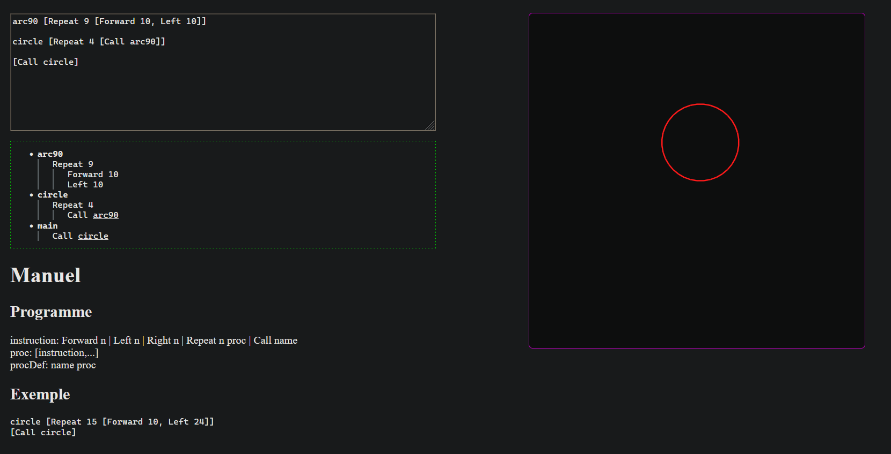

# elp-elm

## Dev

Il est recommandé d'utiliser [elm-live](https://www.elm-live.com/) :

`elm-live src/Main.elm -o -d src -- --output src/index.js`
ou
`dev.bat`

## Lancement

`$ elm make src/Main.elm --output src/main.js`

Puis ouvrir index.html dans un navigateur. Ou utiliser
la [version publiée sur Github Pages](https://gui-yom.github.io/elp-elm).

Les différents composants de l'interface sont synchronisés. Ils se mettent à jour automatiquement à la modification du
programme. Cependant, il est important de noter qu'il existe des "points de sauvegarde". Le panel sur la droite et le
détail du programme afficheront toujours la dernière version fonctionnelle du programme.

## Code

Le code est séparé en fichiers contenant chacun un composant de l'interface.

- `Canvas.elm`: Zone de dessin svg (panel à droite)
- `ErrorList.elm`: Espace décrivant les erreurs dans le programme
- `ProgramList.elm`: Espace détaillant le programme en cours
- `Main.elm`: Page liant tous les composants

Le programme est sauvegardé dans le stockage local du navigateur et persiste en les sessions.

- `LocalStorage.elm`: Bindings vers l'API LocalStorage du navigateur
- `Program.elm`: Parser et checker du programme

## TODO

- Changer de taille de pinceau (ajouter instruction Width)
